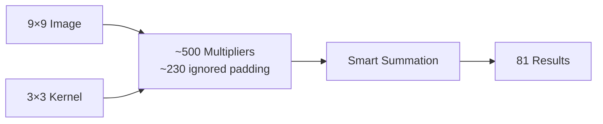
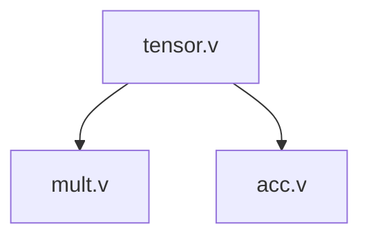
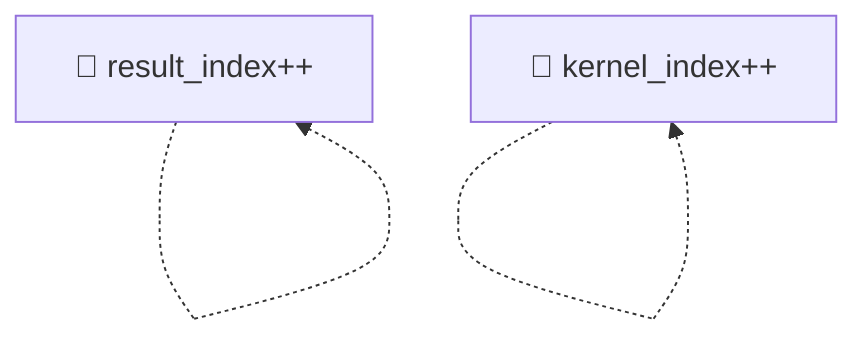
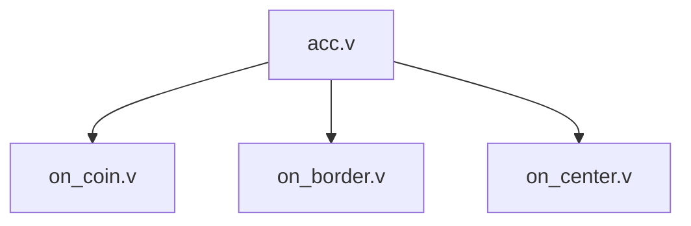
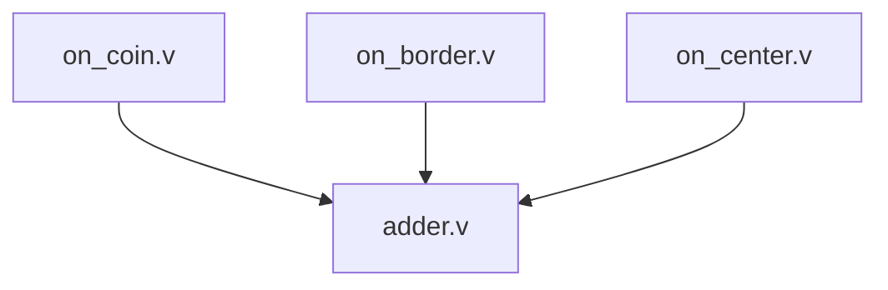
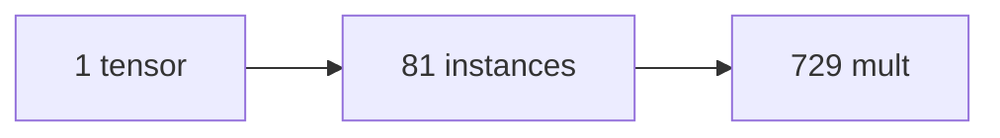
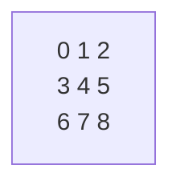
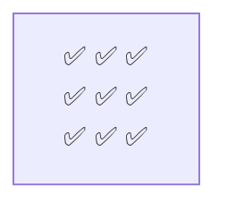

# Hardware 2D Convolution Accelerator

## 🎯 What is this?

A **zero-latency** convolution accelerator that processes 9×9 images with 3×3 kernels using **729 parallel operations**. Pure combinational logic - no clocks, no delays, just instant results.

## ⚡ Quick Demo

```bash
# Run the simulation
iverilog -o sim test.v tensor.v adder.v acc.v mult.v on_*.v && ./sim

# See instant results
result[0] = 160   # Corner pixel (4 taps)
result[10] = 540  # Center pixel (9 taps)
result[80] = 1520 # Bottom-right corner
```

## 🔧 How It Works



1. **729 total combinations** (81 pixels × 9 kernel taps)
2. **~500 active multipliers** (~230 ignored for padding/borders)
3. **Position-aware summation**: corners use 4 taps, borders use 6, center uses 9
4. **Zero control logic** - pure structural Verilog

## 📁 Architecture

### Core Modules

#### **tensor.v** - Main Index Controller
- **Purpose**: Generates one instance per output pixel (81 total)
- **Recursion**: `if (result_index < IMG_SIZE)` creates next instance
- **Parameters**: `result_index` determines which output pixel to compute
- **Instantiates**: `mult.v` and `acc.v` for each pixel position

#### **mult.v** - Multiplication Engine
- **Purpose**: Performs pixel × kernel tap multiplication
- **Recursion**: `if (kernel_index < CONV_SIZE-1)` creates next tap
- **Logic**: Calculates source image coordinates and bounds checking
- **Output**: Stores results in FIFO array for accumulation

#### **acc.v** - Smart Position Router
- **Purpose**: Routes to appropriate handler based on pixel position
- **Logic**: Detects corner/border/center using coordinate calculations
- **Routing**:
  - Corners → `on_coin.v` (4 taps)
  - Borders → `on_border.v` (6 taps)
  - Center → `on_center.v` (9 taps)

#### **on_*.v** - Position-Specific Handlers
- **on_coin.v**: Handles corner pixels, sums 4 valid kernel taps
- **on_border.v**: Handles border pixels, sums 6 valid kernel taps
- **on_center.v**: Handles center pixels, sums all 9 kernel taps
- **Common**: All use `adder_tree` for parallel summation

#### **adder.v** - Tree-Based Summation
- **Purpose**: Efficiently sums multiple values in parallel
- **Recursion**: Splits input in half until base cases (1 or 2 values)
- **Optimization**: Logarithmic depth for minimal delay

#### **mmul.v** - Matrix Multiplication Utility
- **Purpose**: Performs element-wise multiplication of vectors
- **Usage**: Used internally by multiplication stages
- **Recursion**: Processes one element per instance

### Module Connections


### Recursion Pattern


### Position Routing


### Summation


### Instance Count


## 📊 Performance

| Metric | Value |
|--------|-------|
| **Latency** | 0 cycles |
| **Throughput** | 729 ops/cycle |
| **Area** | ~500 multipliers |
| **Scalability** | Any N×N with M×M |

## 🔧 Edge Handling

Different positions use different numbers of kernel taps:

| Position | Taps Used | Example |
|----------|-----------|---------|
| Corner | 4 taps | Skip border pixels |
| Border | 6 taps | Skip one edge |
| Center | 9 taps | Full kernel |

**Kernel Layout:**


**Corner pixels (4 taps):**


**Border pixels (6 taps):**


**Center pixels (9 taps):**


## 🔍 Implementation Details

### Recursive Generation
- **Index recursion**: Advances `result_index` (0→80) to cover all output pixels
- **Mult recursion**: Advances `kernel_index` (0→8) for each kernel tap
- **Result**: 81 × 9 = 729 total instances (~500 active multipliers, ~230 padding ignored)

### Coordinate Transform
```verilog
// From linear indices to 2D coordinates
result_y = result_index / IMG_MAX_X
result_x = result_index % IMG_MAX_X
kernel_y = kernel_index / CONV_MAX_X
kernel_x = kernel_index % CONV_MAX_X

// Calculate source pixel
img_y = result_y + kernel_y - 1
img_x = result_x + kernel_x - 1
```

## 🎯 Applications

- **CNN accelerators** - Zero-latency convolution layers
- **Image processing** - Real-time filtering
- **Computer vision** - Edge detection, feature extraction
- **Signal processing** - 2D correlation, pattern matching

## 🛠️ Customization

Change image and kernel sizes:
```verilog
parameter IMG_MAX_X = 16;   // Larger image
parameter CONV_MAX_X = 5;   // Larger kernel
```

## License

AGPL v3