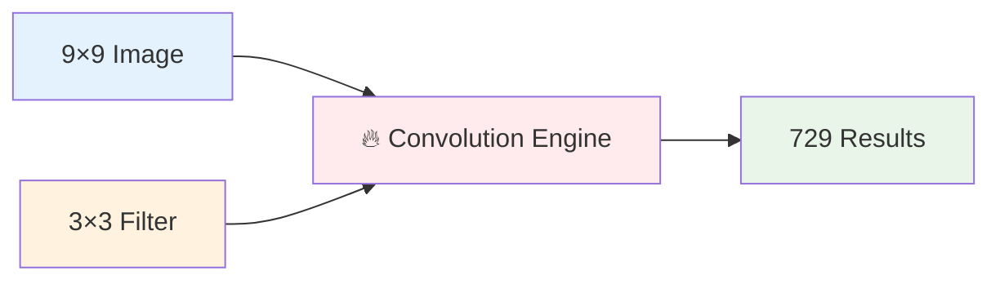
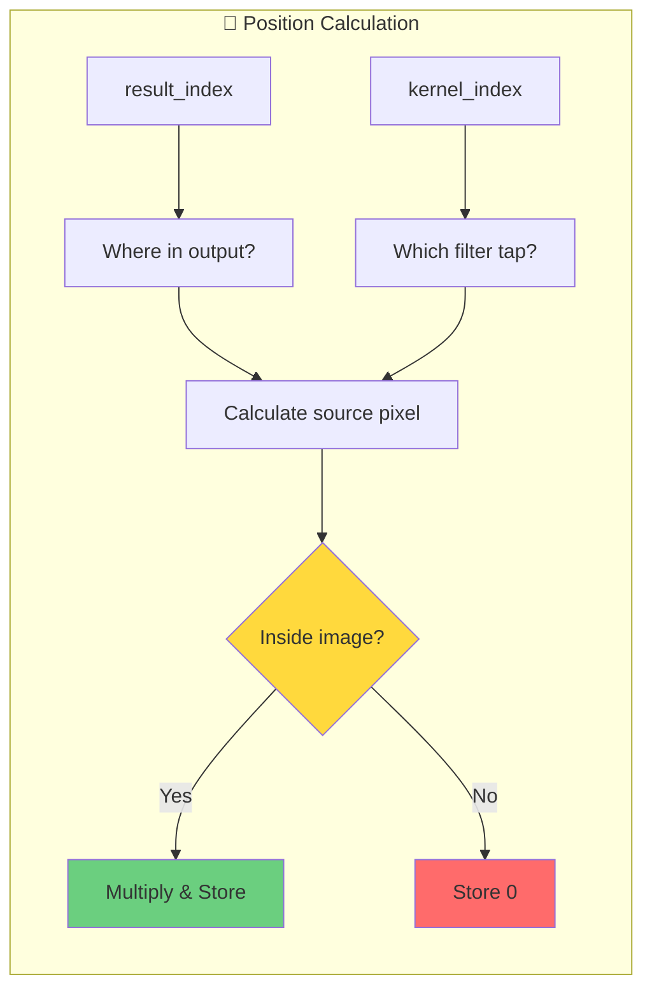
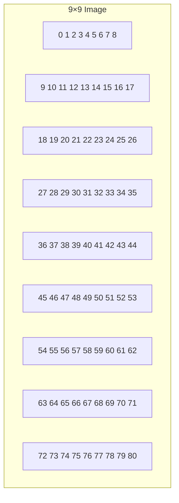
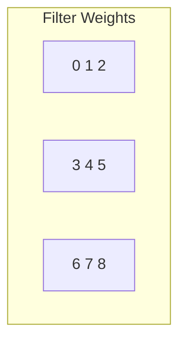
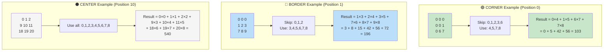
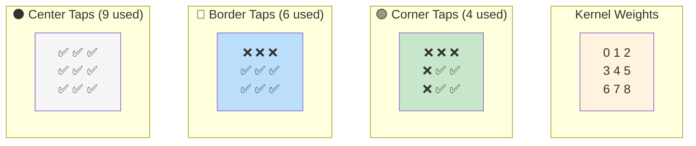
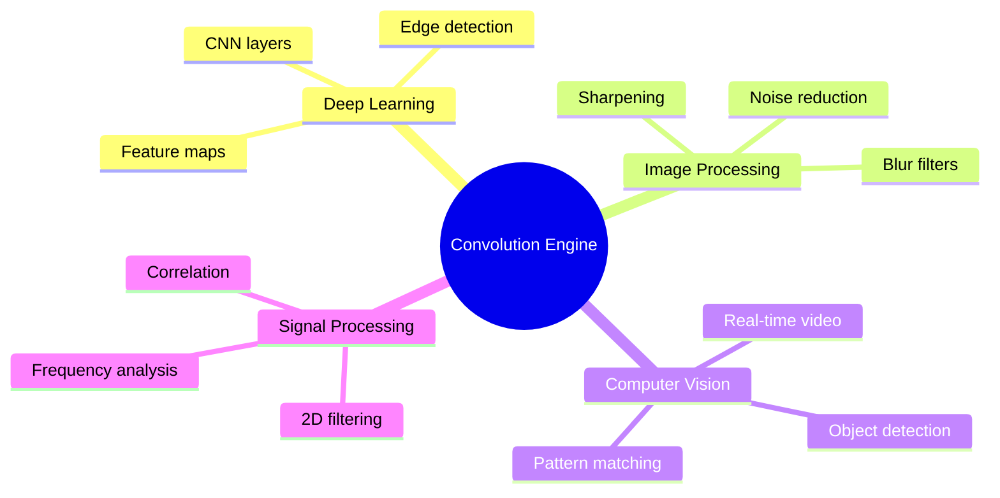

# Hardware 2D Convolution Accelerator

Parallel convolution engine with zero latency and 729 simultaneous operations.

## 🎯 What Does This Do?



Takes a 9×9 image + 3×3 filter → produces all convolution results instantly

## 🏗️ How It Works

```mermaid
graph TD
    subgraph "🔧 Input"
        A[Image: 0,1,2...80]
        B[Kernel: 0,1,2,3,4,5,6,7,8]
    end

    subgraph "⚡ Magic Happens"
        C[729 Parallel Multipliers]
        D[Direct Wire Connections]
        E[No Control Logic!]
    end

    subgraph "📊 Output"
        F[FIFO[0][0] to FIFO[80][8]]
    end

    A --> C
    B --> C
    C --> D
    D --> E
    E --> F

    style C fill:#ff6b6b
    style D fill:#4ecdc4
    style E fill:#45b7d1
```

## 🧠 The Smart Coordinate System



## 📸 Visual Example

### Input Image Layout


### 3×3 Kernel


## ⚡ Performance


## 🛠️ Usage

### 1. Run Simulation
```bash
iverilog -o sim tensor.v adder.v && ./sim
```

### 2. Check Results
```
result[0] = 160   # Corner: 4 taps summed (skip border pixels)
result[1] = 300   # Border: 6 taps summed (skip one edge)
result[10] = 540  # Center: 9 taps summed (full kernel)
...
result[80] = 1520 # Bottom-right corner
```

### 3. Visual Convolution Examples


#### Convolution Types Visualization


#### 3×3 Kernel Layout


### 4. Customize Size
```verilog
parameter IMG_MAX_X = 16;   // Bigger image
parameter CONV_MAX_X = 5;   // Bigger filter
```

## 🔍 Architecture Deep Dive

### 🔄 Double Recursive Propagation

```mermaid
flowchart TD
    subgraph "🔧 Instance Generation"
        A[Current Instance<br/>result_index, kernel_index]
        A --> B{Inside Image?}
        B -->|Yes| C[Calculate: img[pixel] × kernel[tap]]
        B -->|No| D[Skip multiplication]
        C --> E[Store in FIFO[fifo_index]]
        D --> E
    end

    subgraph "📡 Recursive1: FIFO Propagation"
        F{kernel_index < 9?}
        F -->|Yes| G[Generate recursive1<br/>kernel_index + 1]
        G --> H[Propagate FIFO upward]
        F -->|No| I[FIFO complete for result_index]
    end

    subgraph "⚡ Adder Trees: Position-Aware Summation"
        J{kernel_index == 0?}
        J -->|Yes| K[Launch adder_tree]
        K --> L{Position Type?}
        L -->|Corner| M[Sum 4 taps<br/>Skip border taps]
        L -->|Border| N[Sum 6 taps<br/>Skip edge taps]
        L -->|Center| O[Sum all 9 taps]
        M --> P[Store in result[result_index]]
        N --> P
        O --> P
    end

    subgraph "📡 Recursive2: Result Propagation"
        Q{result_index < 81?}
        Q -->|Yes| R[Generate recursive2<br/>result_index + 1]
        R --> S[Propagate result upward]
        Q -->|No| T[All convolutions complete]
    end

    E --> F
    I --> J
    P --> Q

    style A fill:#ff6b6b
    style H fill:#4ecdc4
    style S fill:#6bcf7f
    style T fill:#ffd93d
```

### 🎯 Smart Addressing & Coordinate Transform

```mermaid
flowchart LR
    subgraph "📍 Input Mapping"
        A[result_index] --> B[result_y = idx ÷ 9<br/>result_x = idx mod 9]
        C[kernel_index] --> D[kernel_y = idx ÷ 3<br/>kernel_x = idx mod 3]
    end

    subgraph "🧮 Source Calculation"
        B --> E[img_y = result_y + kernel_y - 1]
        D --> E
        B --> F[img_x = result_x + kernel_x - 1]
        D --> F
        E --> G[img_index = img_y × 9 + img_x]
        F --> G
    end

    subgraph "✅ Boundary Check"
        G --> H{img_y ≥ 0 && img_y < 9<br/>&&<br/>img_x ≥ 0 && img_x < 9}
        H -->|True| I[Extract img[img_index]]
        H -->|False| J[Skip: Outside image]
    end

    style A fill:#e3f2fd
    style C fill:#fff3e0
    style I fill:#e8f5e8
    style J fill:#ffebee
```

### 📦 Data Flow Architecture

```mermaid
graph TD
    subgraph "🔢 Raw Data"
        A[9×9 Image<br/>81 pixels]
        B[3×3 Kernel<br/>9 weights]
    end

    subgraph "⚡ Processing Layer"
        C[729 Parallel<br/>Multiplications]
        D[FIFO Storage<br/>81×9 = 729 values]
    end

    subgraph "🎯 Aggregation Layer"
        E[Position Detection<br/>Corner/Border/Center]
        F[Selective Summation<br/>4/6/9 taps]
        G[81 Adder Trees]
    end

    subgraph "📊 Final Output"
        H[result[0..80]<br/>81 convolution results]
    end

    A --> C
    B --> C
    C --> D
    D --> E
    E --> F
    F --> G
    G --> H

    style C fill:#ff6b6b
    style D fill:#4ecdc4
    style G fill:#45b7d1
    style H fill:#6bcf7f
```

## 🎯 Why This Rocks

| Feature | Benefit |
|---------|---------|
| 🚀 **Zero Latency** | Results available instantly |
| ⚡ **Massive Parallel** | 729 operations at once |
| 🔧 **No Control Logic** | Just multipliers + wires |
| 📦 **Easy Integration** | Drop into any FPGA design |
| 🎯 **Configurable** | Change sizes easily |

## 🌟 Applications



## License

AGPL v3