# Hardware 2D Convolution Accelerator

Parallel convolution engine with zero latency and 729 simultaneous operations.

## 🎯 What Does This Do?

## ⚡ ZERO LOGIC GENERATION - PURE WIRING ⚡
**This design uses NO control logic whatsoever.**
**Everything is preprocessed and handled by direct wiring connections.**
**The hardware is 100% combinational - zero latency, zero delays, just pure parallel multiplication and addition.**

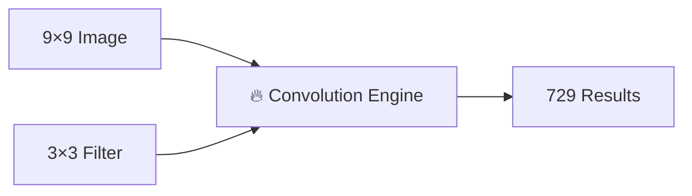

Takes a 9×9 image + 3×3 filter → produces all convolution results instantly

## How It Works

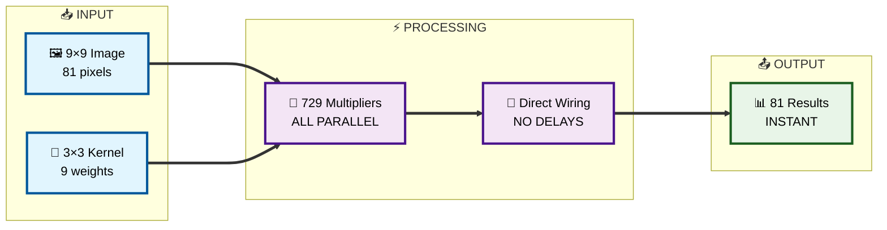

## 🧠 The Smart Coordinate System

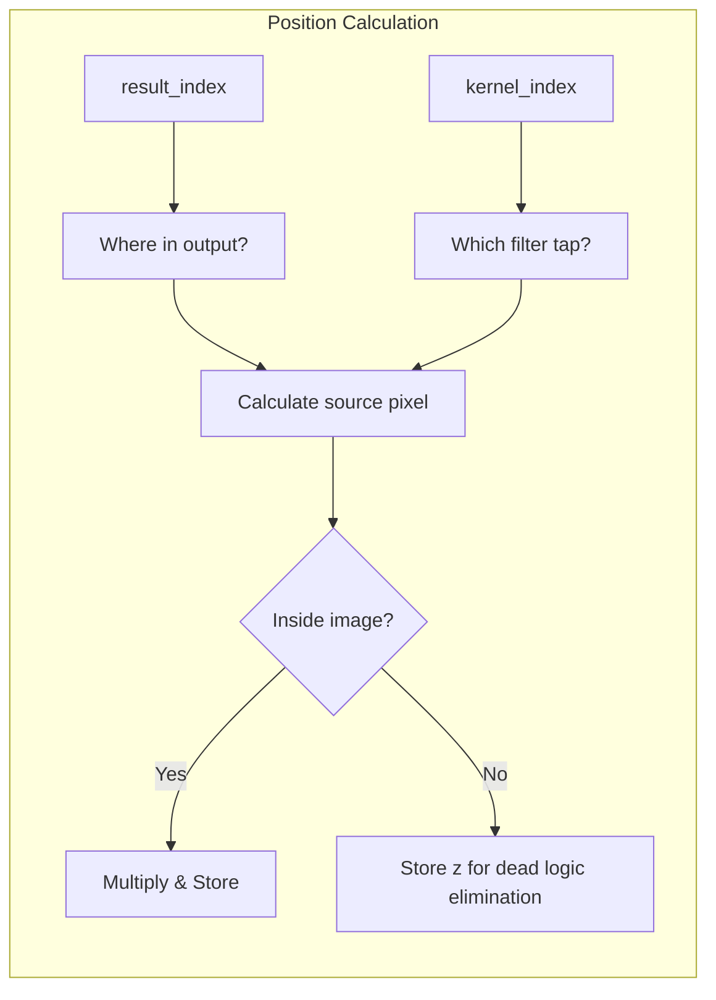

## 📸 Visual Example

### Input Image Layout
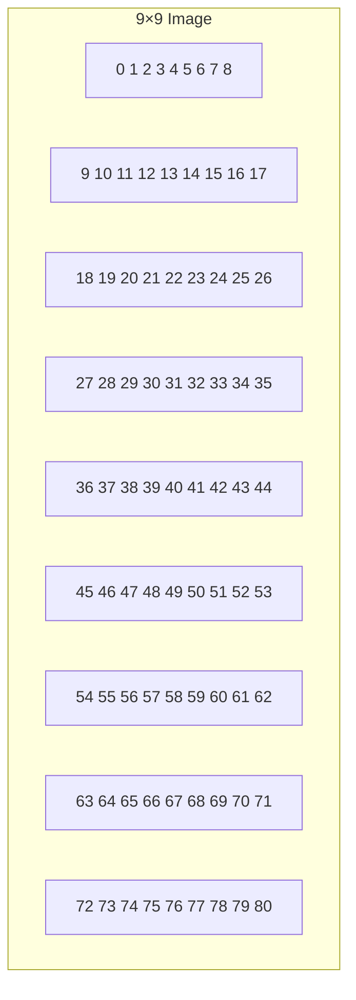

### 3×3 Kernel
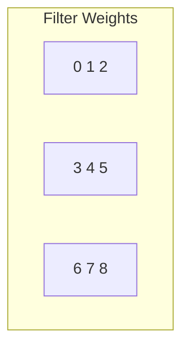

## 🏗️ Module Architecture

### Core Files
- **tensor.v** - **Recursive index module** that generates 81 instances (one per output pixel)
- **mult.v** - **Recursive multiplication stage** that generates 9 instances per pixel (one per kernel tap)
- **acc.v** - Accumulator module that routes to position-specific handlers
- **adder.v** - Tree-based adder for efficient parallel summation
- **on_center.v** - Handles 9-tap convolution for center pixels
- **on_border.v** - Handles 6-tap convolution for border pixels
- **on_coin.v** - Handles 4-tap convolution for corner pixels
- **test.v** - Test bench with comprehensive validation

### Recursive Architecture
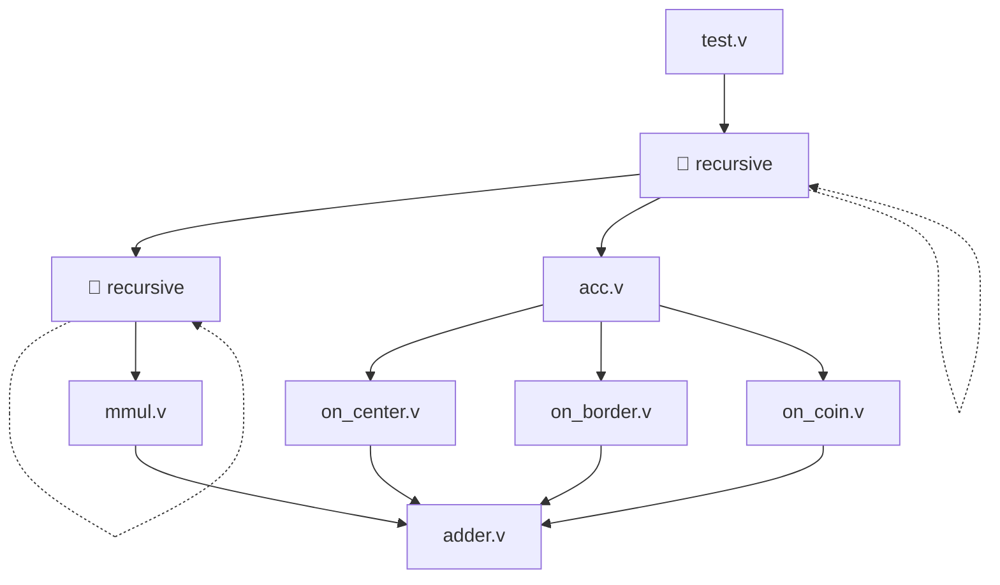

## ⚡ Performance


## 🛠️ Usage

### 1. Run Simulation
```bash
iverilog -o sim test.v tensor.v adder.v acc.v mult.v on_*.v && ./sim
```

### 2. Check Results
```
result[0] = 160   # Corner: 4 taps summed (skip border pixels)
result[1] = 300   # Border: 6 taps summed (skip one edge)
result[10] = 540  # Center: 9 taps summed (full kernel)
...
result[80] = 1520 # Bottom-right corner
```

### 3. Visual Convolution Examples


#### Convolution Types Visualization
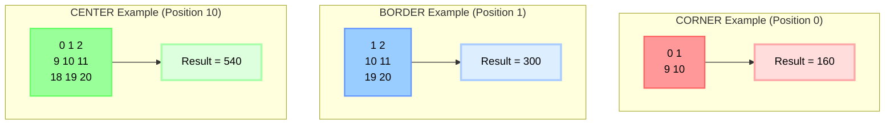

#### 3×3 Kernel Layout
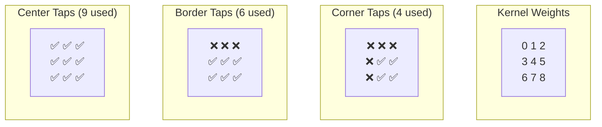

### 4. Customize Size
```verilog
parameter IMG_MAX_X = 16;   // Bigger image
parameter CONV_MAX_X = 5;   // Bigger filter
```

## 🔍 Architecture Deep Dive

### Double Recursive Architecture Explained

The system uses **two levels of recursion** to generate all 729 operations:

#### 1. Index Recursion (tensor.v) - Advances result_index
**Purpose**: Process convolution for ALL image cells (0 to 80)
**Recursion**: Increments `result_index` to cover every output pixel
```verilog
if (result_index < IMG_SIZE)
    index #(.result_index(result_index + 1)) genblk_index (img, kernel, FIFO, result);
```

#### 2. Mult Recursion (mult.v) - Advances kernel_index
**Purpose**: Process ALL kernel multiplications (0 to 8) for each image cell
**Recursion**: Increments `kernel_index` to cover every kernel tap
```verilog
if (kernel_index < CONV_SIZE - 1)
    mult #(.kernel_index(kernel_index+1)) mult_stage(img, kernel, FIFO, result);
```

**Key Insight**:
- `index` recursion → covers all **image positions** (result_index 0→80)
- `mult` recursion → covers all **kernel taps** (kernel_index 0→8) for each position
- Result: 81 × 9 = **729 parallel multiplications**

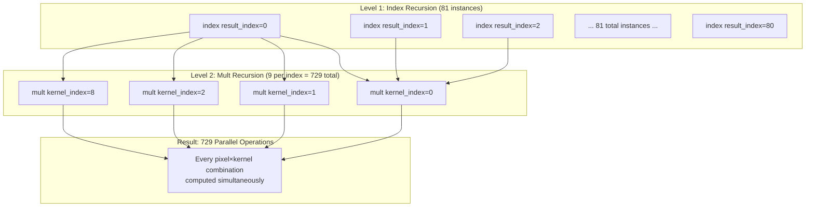

### Smart Addressing & Coordinate Transform

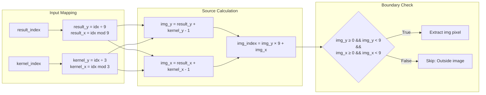

### Data Flow Architecture

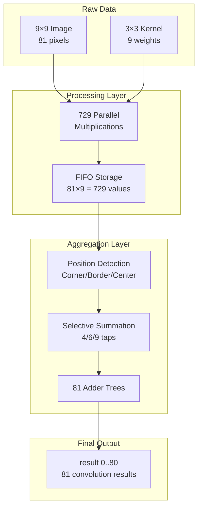

## 🎯 Why This Rocks

| Feature | Benefit |
|---------|---------|
| 🚀 **Zero Latency** | Results available instantly |
| ⚡ **Massive Parallel** | 729 operations at once |
| 🔧 **No Control Logic** | Just multipliers + wires |
| 📦 **Easy Integration** | Drop into any ASIC design |
| 🎯 **Configurable** | Change sizes easily |

## 🌟 Applications

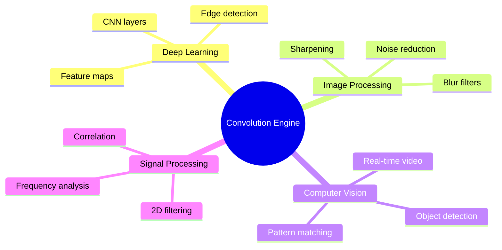

## License

AGPL v3