# Hardware 2D Convolution Accelerator

Parallel convolution engine with zero latency and 729 simultaneous operations.

## 🎯 What Does This Do?

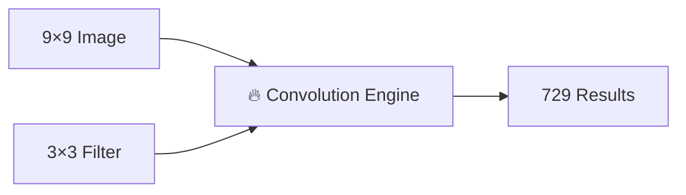

Takes a 9×9 image + 3×3 filter → produces all convolution results instantly

## How It Works

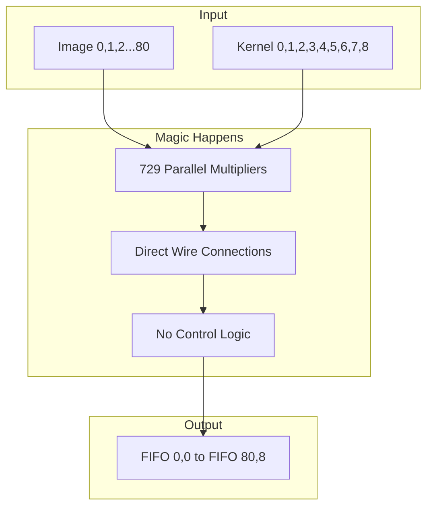

## 🧠 The Smart Coordinate System

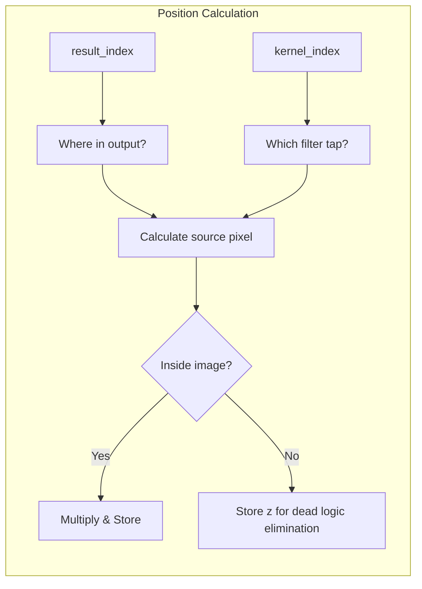

## 📸 Visual Example

### Input Image Layout
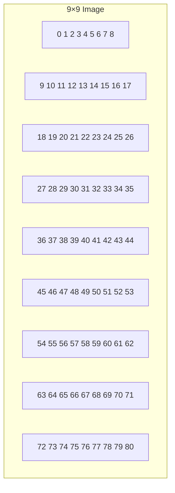

### 3×3 Kernel
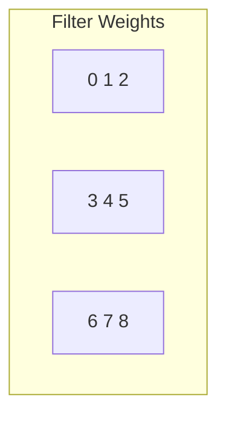

## ⚡ Performance


## 🛠️ Usage

### 1. Run Simulation
```bash
iverilog -o sim tensor.v adder.v && ./sim
```

### 2. Check Results
```
result[0] = 160   # Corner: 4 taps summed (skip border pixels)
result[1] = 300   # Border: 6 taps summed (skip one edge)
result[10] = 540  # Center: 9 taps summed (full kernel)
...
result[80] = 1520 # Bottom-right corner
```

### 3. Visual Convolution Examples

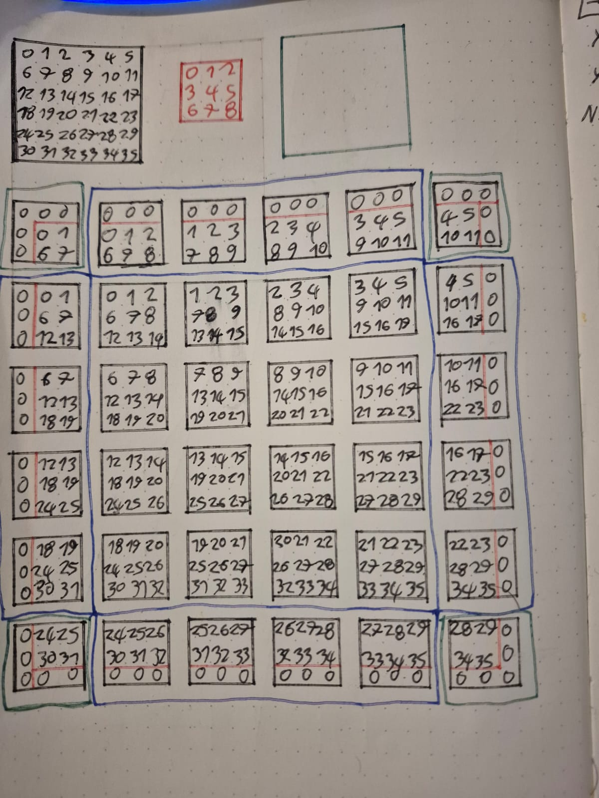

#### Convolution Types Visualization
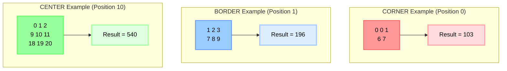

#### 3×3 Kernel Layout
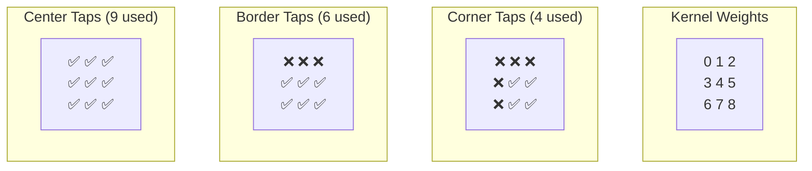

### 4. Customize Size
```verilog
parameter IMG_MAX_X = 16;   // Bigger image
parameter CONV_MAX_X = 5;   // Bigger filter
```

## 🔍 Architecture Deep Dive

### Double Recursive Propagation

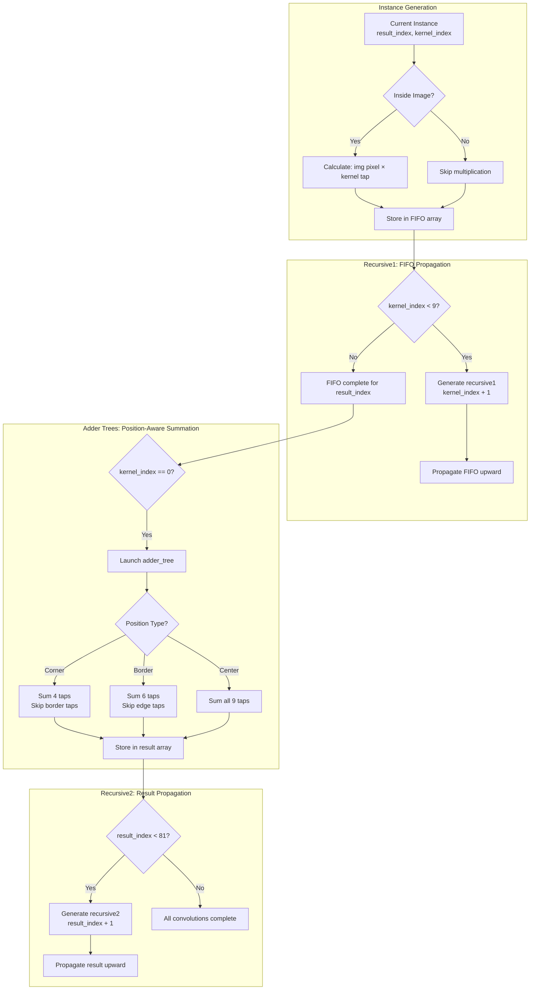

### Smart Addressing & Coordinate Transform

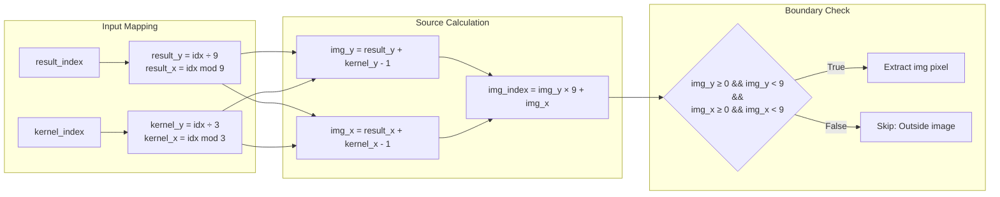

### Data Flow Architecture

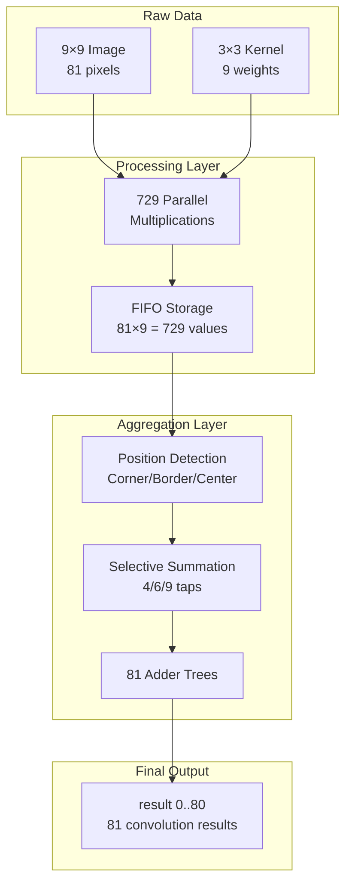

## 🎯 Why This Rocks

| Feature | Benefit |
|---------|---------|
| 🚀 **Zero Latency** | Results available instantly |
| ⚡ **Massive Parallel** | 729 operations at once |
| 🔧 **No Control Logic** | Just multipliers + wires |
| 📦 **Easy Integration** | Drop into any ASIC design |
| 🎯 **Configurable** | Change sizes easily |

## 🌟 Applications

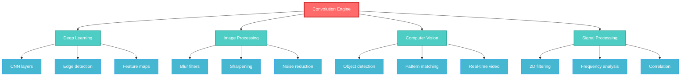

## License

AGPL v3