# Accélérateur Hardware de Convolution 2D

Moteur de convolution parallèle avec latence zéro et 729 opérations simultanées.

## 🎯 Que fait ce module ?

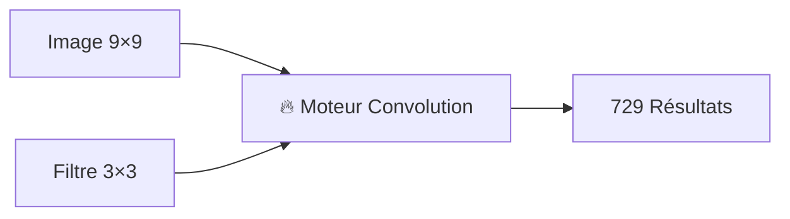

Prend une image 9×9 + filtre 3×3 → produit tous les résultats de convolution instantanément

## Comment ça marche

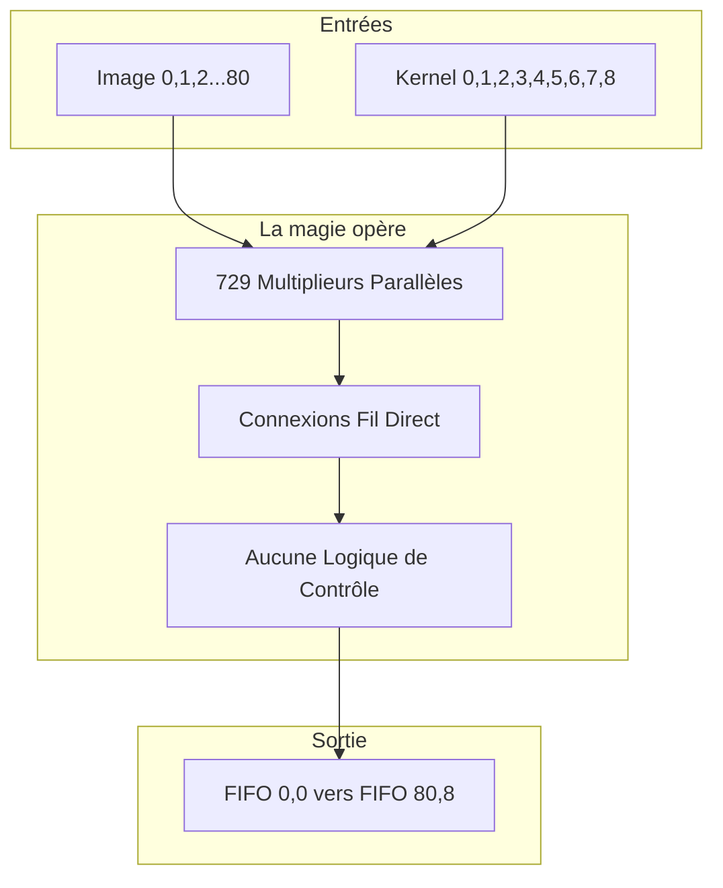

## 🧠 Système de Coordonnées Intelligent

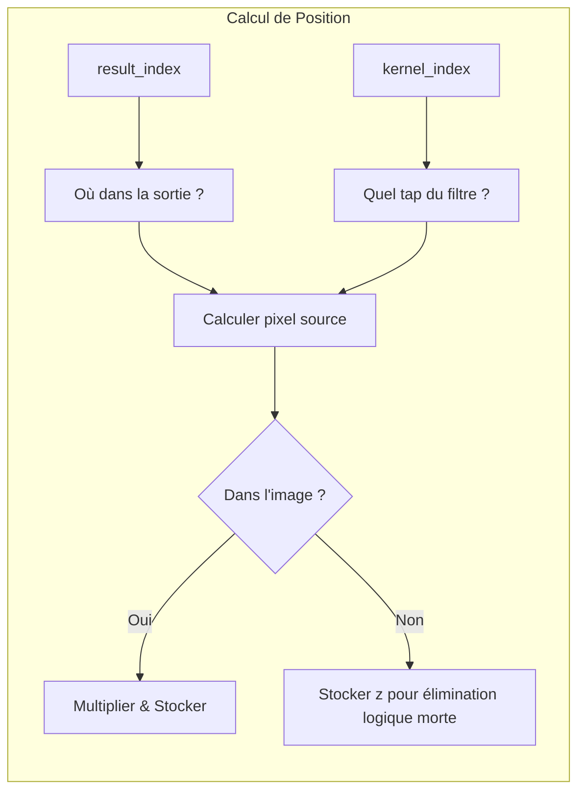

## 📸 Exemple Visuel

### Disposition Image d'Entrée
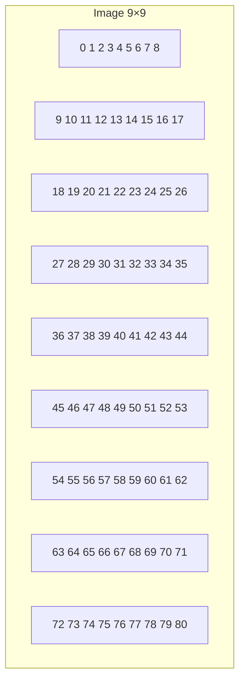

### Kernel 3×3
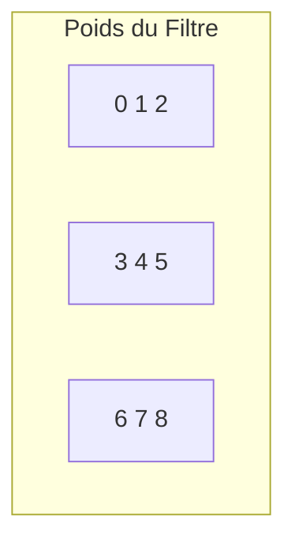

## ⚡ Performances


## 🛠️ Utilisation

### 1. Lancer la Simulation
```bash
iverilog -o sim tensor.v adder.v && ./sim
```

### 2. Vérifier les Résultats
```
result[0] = 160   # Coin: 4 taps sommés (évite bordures)
result[1] = 300   # Bordure: 6 taps sommés (évite un côté)
result[10] = 540  # Centre: 9 taps sommés (kernel complet)
...
result[80] = 1520 # Coin bas-droite
```

### 3. Exemples Visuels de Convolution


#### Visualisation Types de Convolution
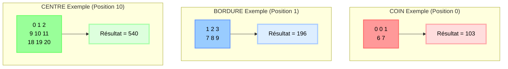

#### Disposition Kernel 3×3
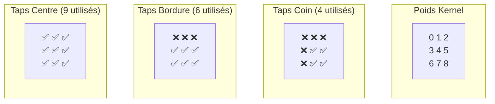

### 4. Personnaliser la Taille
```verilog
parameter IMG_MAX_X = 16;   // Image plus grande
parameter CONV_MAX_X = 5;   // Filtre plus grand
```

## 🔍 Architecture Approfondie

### Propagation Doublement Récursive

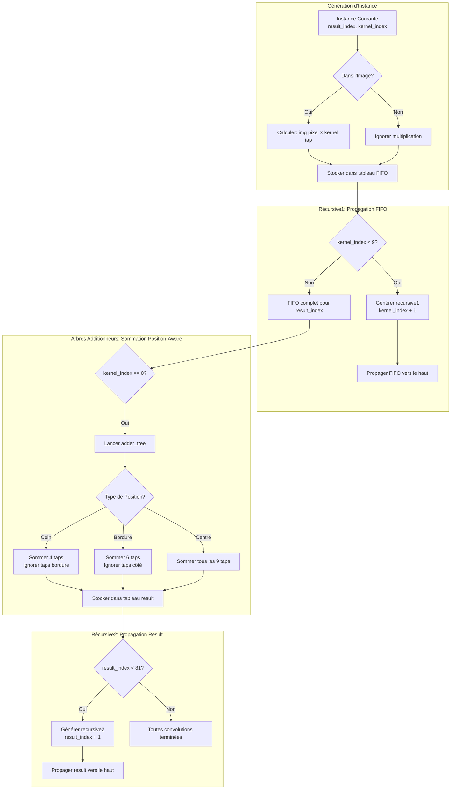

### Adressage Intelligent & Transformation Coordonnées

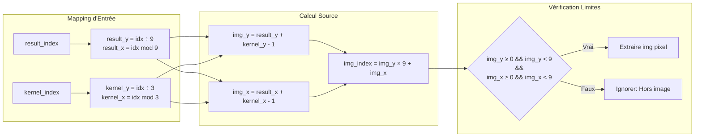

### Architecture Flux de Données

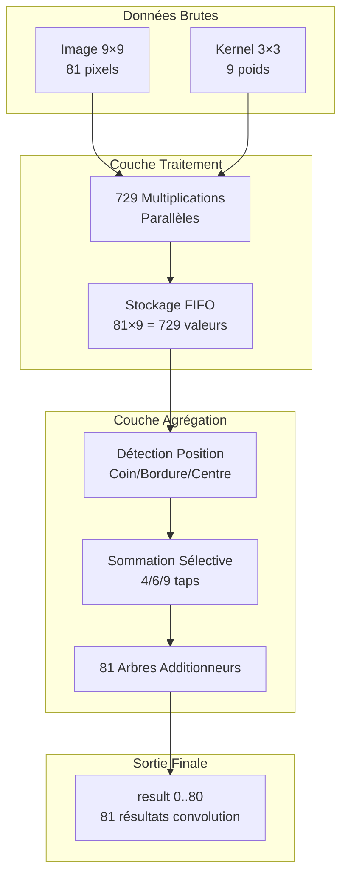

## 🎯 Pourquoi c'est génial

| Fonctionnalité | Avantage |
|----------------|----------|
| 🚀 **Latence Zéro** | Résultats disponibles instantanément |
| ⚡ **Parallèle Massif** | 729 opérations à la fois |
| 🔧 **Pas de Logique de Contrôle** | Juste multiplieurs + fils |
| 📦 **Intégration Facile** | Intégrer dans n'importe quel design ASIC |
| 🎯 **Configurable** | Changer les tailles facilement |

## 🌟 Applications

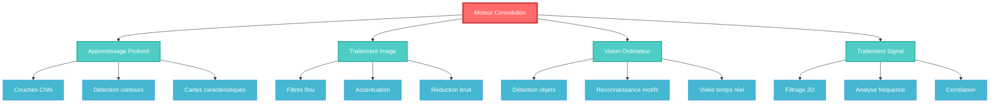

## 🔬 Comment ça marche vraiment

### Le Secret : Récursion Paramétrique
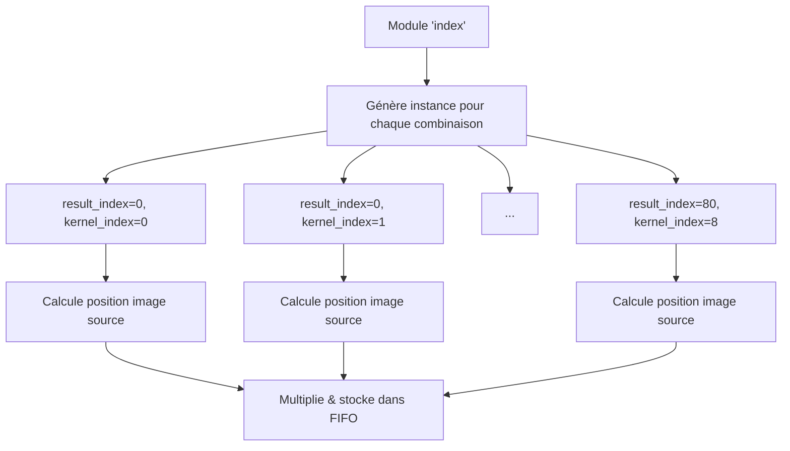

### Transformation Coordonnées Magique
```mermaid
graph LR
    A[result_index=10] --> B[Position sortie: ligne 1, col 1]
    C[kernel_index=4] --> D[Centre du kernel 3×3]
    B --> E[Pixel source: position 10 dans image]
    D --> E
    E --> F[img[10] × kernel[4] = 10 × 4 = 40]
    F --> G[Stocké dans FIFO[10][4]]

```

## Licence

AGPL v3