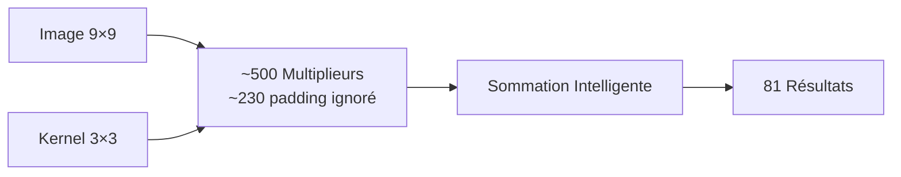
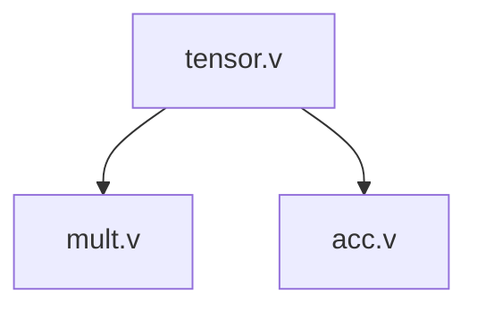
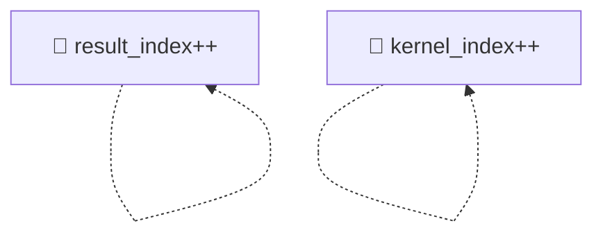
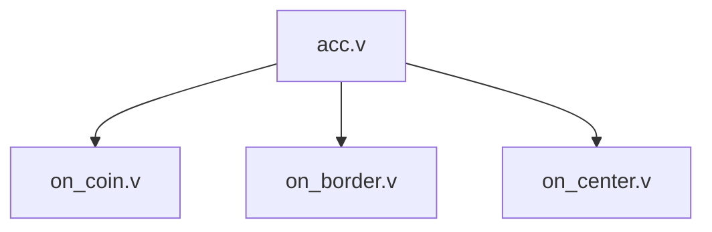
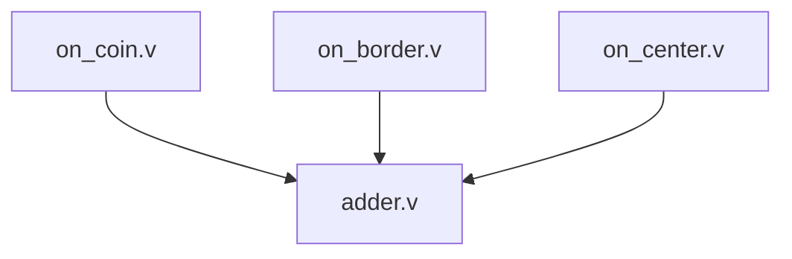
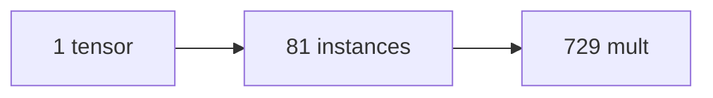
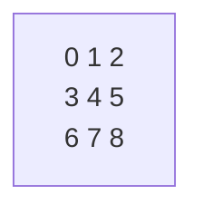
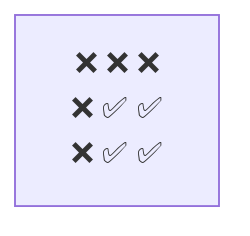
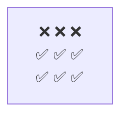
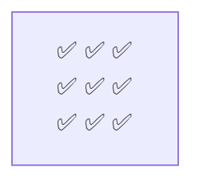

# Accélérateur Hardware de Convolution 2D

## 🎯 Qu'est-ce que c'est ?

Un accélérateur de convolution **latence zéro** qui traite des images 9×9 avec des kernels 3×3 en utilisant **729 opérations parallèles**. Logique combinatoire pure - pas d'horloge, pas de délai, juste des résultats instantanés.

## ⚡ Demo Rapide

```bash
# Lancer la simulation
iverilog -o sim test.v tensor.v adder.v acc.v mult.v on_*.v && ./sim

# Voir les résultats instantanés
result[0] = 160   # Pixel coin (4 taps)
result[10] = 540  # Pixel centre (9 taps)
result[80] = 1520 # Coin bas-droite
```

## 🔧 Comment Ça Marche



1. **729 combinaisons totales** (81 pixels × 9 taps kernel)
2. **~500 multiplieurs actifs**, ~230 ignorés pour padding/bordures
3. **Sommation position-aware** : coins utilisent 4 taps, bordures 6, centre 9
4. **Zéro logique de contrôle** - Verilog structurel pur

## 📁 Architecture

### Modules Principaux

#### **tensor.v** - Contrôleur Index Principal
- **Objectif**: Génère une instance par pixel de sortie (81 total)
- **Récursion**: `if (result_index < IMG_SIZE)` crée l'instance suivante
- **Paramètres**: `result_index` détermine quel pixel de sortie calculer
- **Instancie**: `mult.v` et `acc.v` pour chaque position de pixel

#### **mult.v** - Moteur de Multiplication
- **Objectif**: Effectue la multiplication pixel × tap du kernel
- **Récursion**: `if (kernel_index < CONV_SIZE-1)` crée le tap suivant
- **Logique**: Calcule les coordonnées image source et vérification des limites
- **Sortie**: Stocke les résultats dans le tableau FIFO pour accumulation

#### **acc.v** - Routeur de Position Intelligent
- **Objectif**: Route vers le gestionnaire approprié selon la position du pixel
- **Logique**: Détecte coin/bordure/centre via calculs de coordonnées
- **Routage**:
  - Coins → `on_coin.v` (4 taps)
  - Bordures → `on_border.v` (6 taps)
  - Centre → `on_center.v` (9 taps)

#### **on_*.v** - Gestionnaires Spécifiques à la Position
- **on_coin.v**: Gère les pixels de coin, somme 4 taps valides du kernel
- **on_border.v**: Gère les pixels de bordure, somme 6 taps valides du kernel
- **on_center.v**: Gère les pixels centraux, somme tous les 9 taps du kernel
- **Commun**: Tous utilisent `adder_tree` pour sommation parallèle

#### **adder.v** - Sommation Arborescente
- **Objectif**: Somme efficacement plusieurs valeurs en parallèle
- **Récursion**: Divise l'entrée en deux jusqu'aux cas de base (1 ou 2 valeurs)
- **Optimisation**: Profondeur logarithmique pour délai minimal

#### **mmul.v** - Utilitaire de Multiplication Matricielle
- **Objectif**: Effectue la multiplication élément par élément de vecteurs
- **Usage**: Utilisé en interne par les étapes de multiplication
- **Récursion**: Traite un élément par instance

### Connexions Modules


### Motif Récursion


### Routage Position


### Sommation


### Compte Instances


## 🔧 Gestion des Bordures

Différentes positions utilisent différents nombres de taps du kernel :

| Position | Taps Utilisés | Exemple |
|----------|---------------|---------|
| Coin | 4 taps | Évite pixels bordure |
| Bordure | 6 taps | Évite un côté |
| Centre | 9 taps | Kernel complet |

**Disposition Kernel :**


**Pixels coin (4 taps) :**


**Pixels bordure (6 taps) :**


**Pixels centre (9 taps) :**


## 📊 Performance

| Métrique | Valeur |
|----------|--------|
| **Latence** | 0 cycles |
| **Débit** | 729 ops/cycle |
| **Surface** | ~500 multiplieurs |
| **Scalabilité** | N'importe quel N×N avec M×M |

## 🔍 Détails Techniques

### Génération Récursive
- **Récursion Index** : Fait avancer `result_index` (0→80) pour couvrir tous les pixels de sortie
- **Récursion Mult** : Fait avancer `kernel_index` (0→8) pour chaque tap du kernel
- **Résultat** : 81 × 9 = 729 instances totales (~500 multiplieurs actifs, ~230 padding ignoré)


### Transformation Coordonnées
```verilog
// Des indices linéaires aux coordonnées 2D
result_y = result_index / IMG_MAX_X
result_x = result_index % IMG_MAX_X
kernel_y = kernel_index / CONV_MAX_X
kernel_x = kernel_index % CONV_MAX_X

// Calculer pixel source
img_y = result_y + kernel_y - 1
img_x = result_x + kernel_x - 1
```

## 🎯 Applications

- **Accélérateurs CNN** - Couches de convolution latence zéro
- **Traitement d'image** - Filtrage temps réel
- **Vision par ordinateur** - Détection contours, extraction caractéristiques
- **Traitement signal** - Corrélation 2D, reconnaissance motifs

## 🛠️ Personnalisation

Changer les tailles d'image et kernel :
```verilog
parameter IMG_MAX_X = 16;   // Image plus grande
parameter CONV_MAX_X = 5;   // Kernel plus grand
```

## Licence

AGPL v3