# Accélérateur Hardware de Convolution 2D

Moteur de convolution parallèle avec latence zéro et 729 opérations simultanées.

## 🎯 Que fait ce module ?

## ⚡ ZÉRO GÉNÉRATION DE LOGIQUE - CÂBLAGE PUR ⚡
**Ce design n'utilise AUCUNE logique de contrôle.**
**Tout est préprocessé et géré par des connexions de câblage direct.**
**Le hardware est 100% combinatoire - zéro latence, zéro délai, juste de la multiplication et addition parallèle pure.**

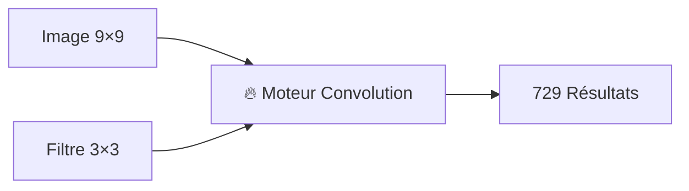

Prend une image 9×9 + filtre 3×3 → produit tous les résultats de convolution instantanément

## Comment ça marche

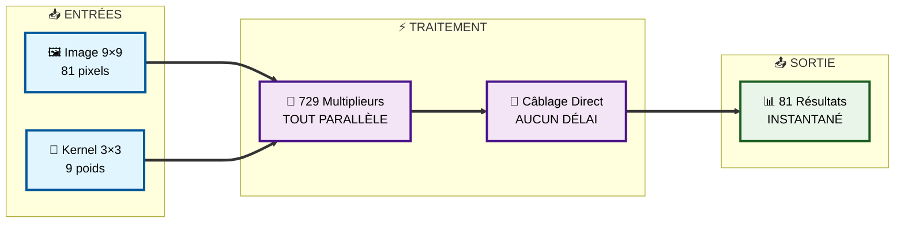

## 🧠 Système de Coordonnées Intelligent

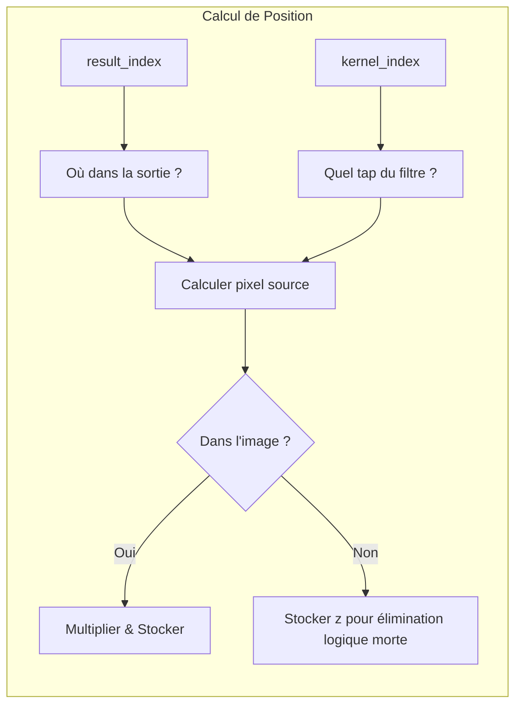

## 📸 Exemple Visuel

### Disposition Image d'Entrée
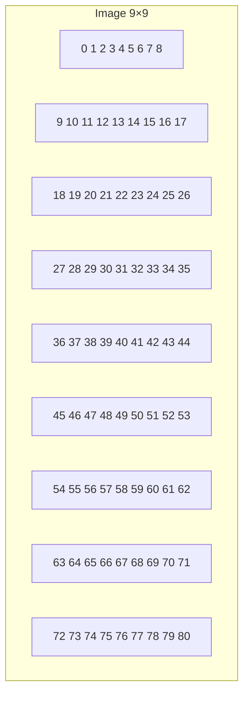

### Kernel 3×3
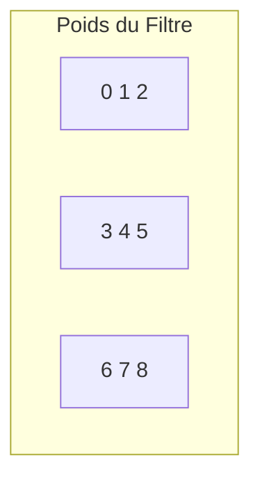

## ⚡ Performances


## 🛠️ Utilisation

### 1. Lancer la Simulation
```bash
iverilog -o sim test.v tensor.v adder.v acc.v mult.v on_*.v && ./sim
```

### 2. Vérifier les Résultats
```
result[0] = 160   # Coin: 4 taps sommés (évite bordures)
result[1] = 300   # Bordure: 6 taps sommés (évite un côté)
result[10] = 540  # Centre: 9 taps sommés (kernel complet)
...
result[80] = 1520 # Coin bas-droite
```

### 3. Exemples Visuels de Convolution


#### Visualisation Types de Convolution
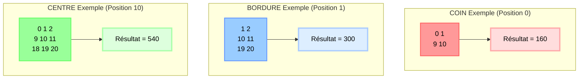

#### Disposition Kernel 3×3
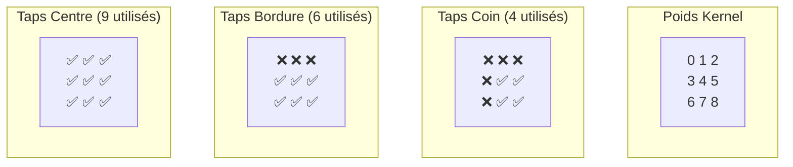

## 🏗️ Architecture des Modules

### Fichiers Principaux
- **tensor.v** - **Module index récursif** qui génère 81 instances (une par pixel de sortie)
- **mult.v** - **Étape de multiplication récursive** qui génère 9 instances par pixel (une par tap du kernel)
- **acc.v** - Module accumulateur qui route vers les gestionnaires spécifiques à la position
- **adder.v** - Additionneur arborescent pour sommation parallèle efficace
- **on_center.v** - Gère la convolution 9-tap pour les pixels centraux
- **on_border.v** - Gère la convolution 6-tap pour les pixels de bordure
- **on_coin.v** - Gère la convolution 4-tap pour les pixels de coin
- **test.v** - Banc de test avec validation complète

### Architecture Récursive
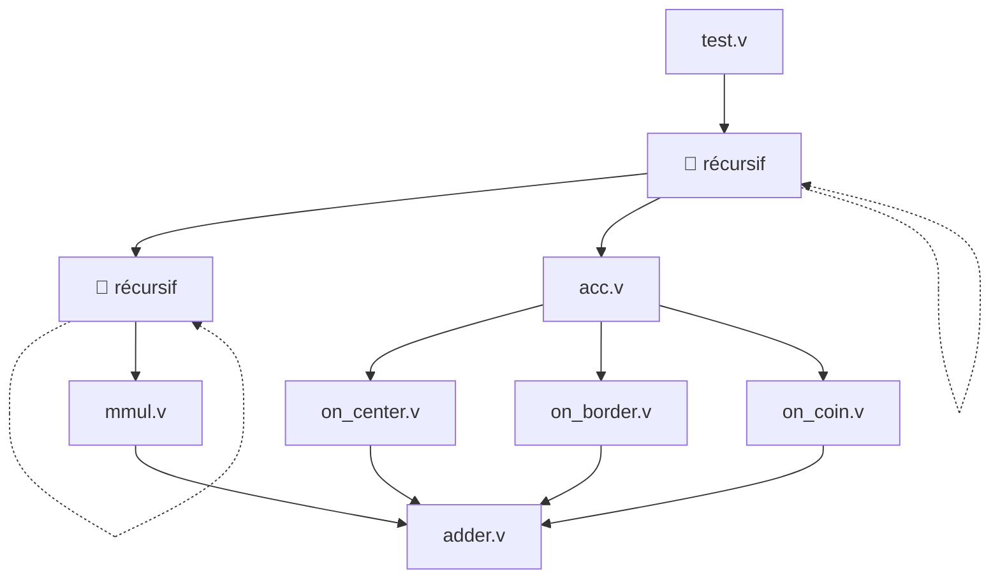

### 4. Personnaliser la Taille
```verilog
parameter IMG_MAX_X = 16;   // Image plus grande
parameter CONV_MAX_X = 5;   // Filtre plus grand
```

## 🔍 Architecture Approfondie

### Architecture Doublement Récursive Expliquée

Le système utilise **deux niveaux de récursion** pour générer toutes les 729 opérations :

#### 1. Récursion Index (tensor.v) - Fait avancer result_index
**Objectif**: Traiter la convolution pour TOUTES les cellules de l'image (0 à 80)
**Récursion**: Incrémente `result_index` pour couvrir chaque pixel de sortie
```verilog
if (result_index < IMG_SIZE)
    index #(.result_index(result_index + 1)) genblk_index (img, kernel, FIFO, result);
```

#### 2. Récursion Mult (mult.v) - Fait avancer kernel_index
**Objectif**: Traiter TOUTES les multiplications du kernel (0 à 8) pour chaque cellule d'image
**Récursion**: Incrémente `kernel_index` pour couvrir chaque tap du kernel
```verilog
if (kernel_index < CONV_SIZE - 1)
    mult #(.kernel_index(kernel_index+1)) mult_stage(img, kernel, FIFO, result);
```

**Point Clé**:
- Récursion `index` → couvre toutes les **positions image** (result_index 0→80)
- Récursion `mult` → couvre tous les **taps kernel** (kernel_index 0→8) pour chaque position
- Résultat: 81 × 9 = **729 multiplications parallèles**

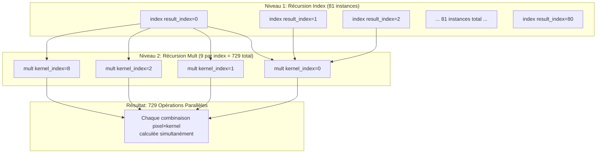

### Adressage Intelligent & Transformation Coordonnées

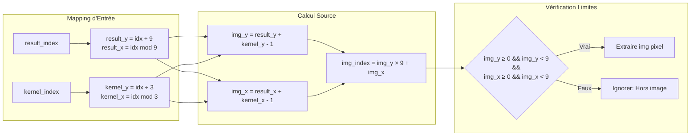

### Architecture Flux de Données

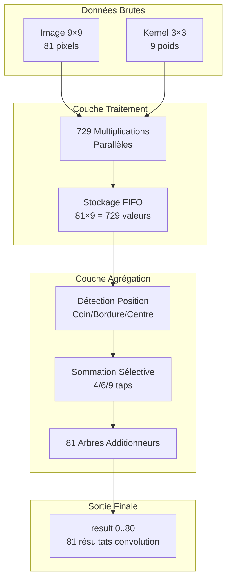

## 🎯 Pourquoi c'est génial

| Fonctionnalité | Avantage |
|----------------|----------|
| 🚀 **Latence Zéro** | Résultats disponibles instantanément |
| ⚡ **Parallèle Massif** | 729 opérations à la fois |
| 🔧 **Pas de Logique de Contrôle** | Juste multiplieurs + fils |
| 📦 **Intégration Facile** | Intégrer dans n'importe quel design ASIC |
| 🎯 **Configurable** | Changer les tailles facilement |

## 🌟 Applications

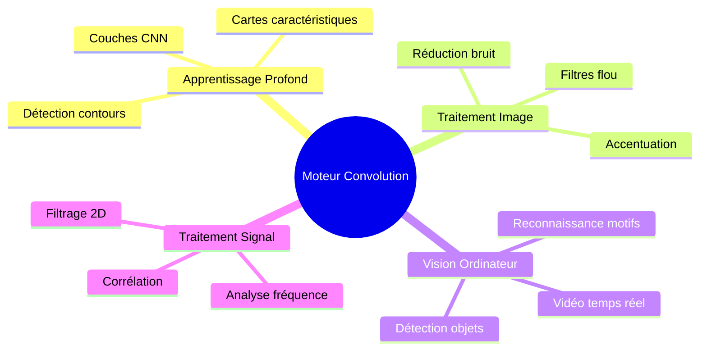

### Transformation Coordonnées Magique
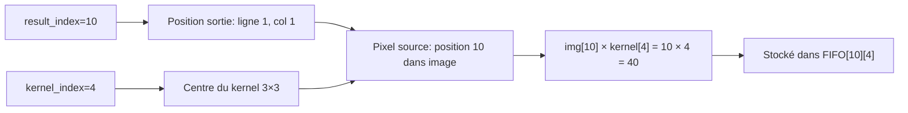

## Licence

AGPL v3