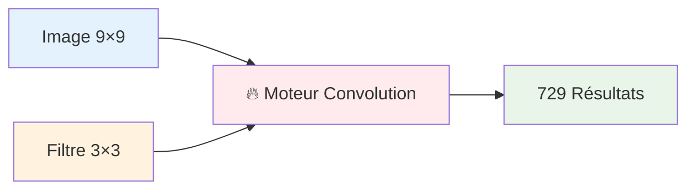
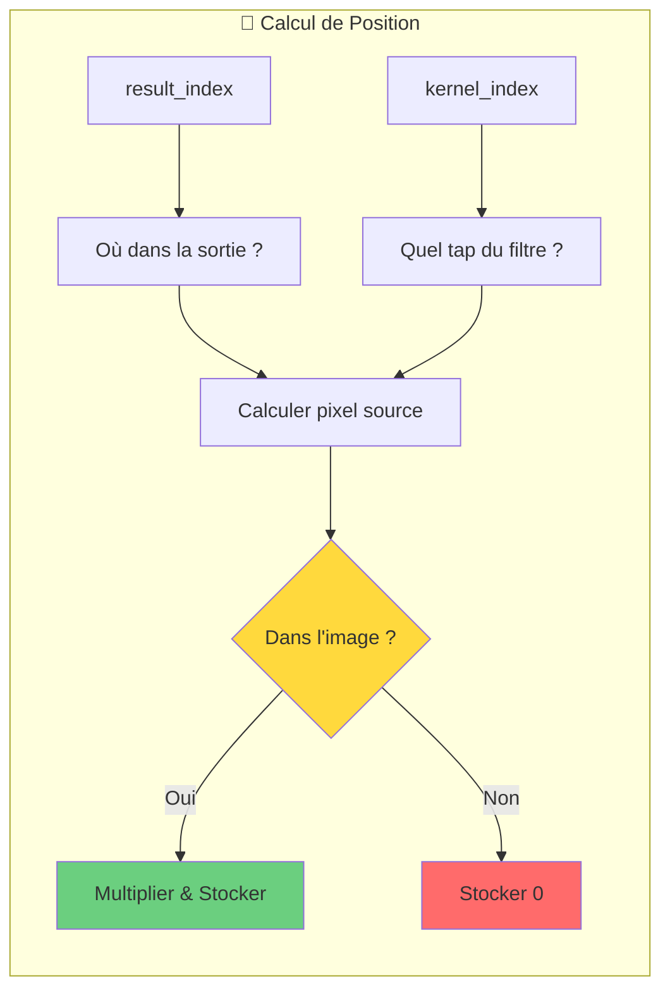
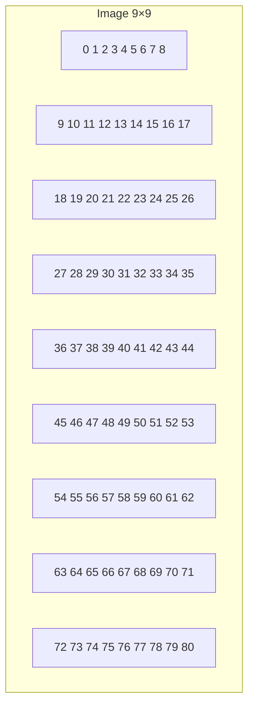
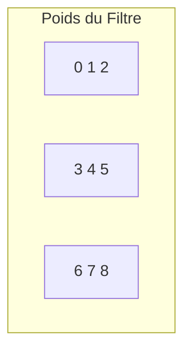
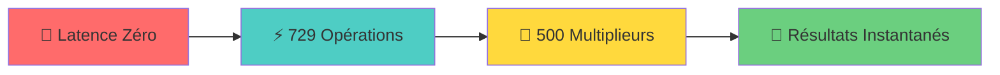
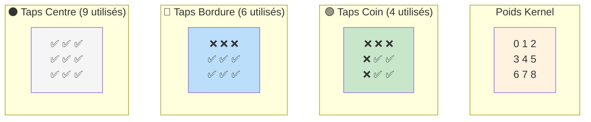
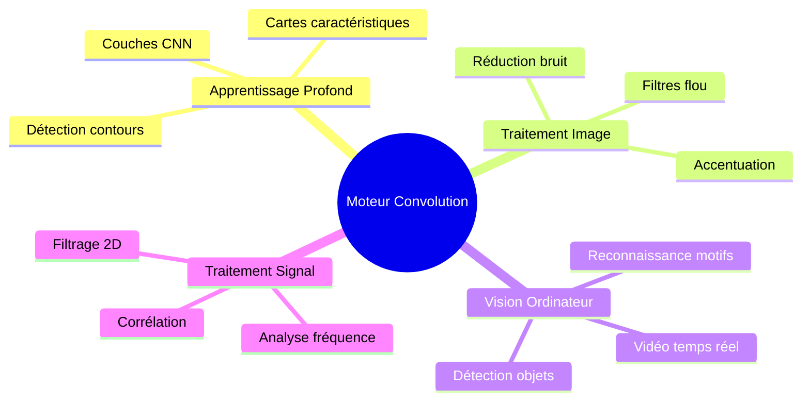
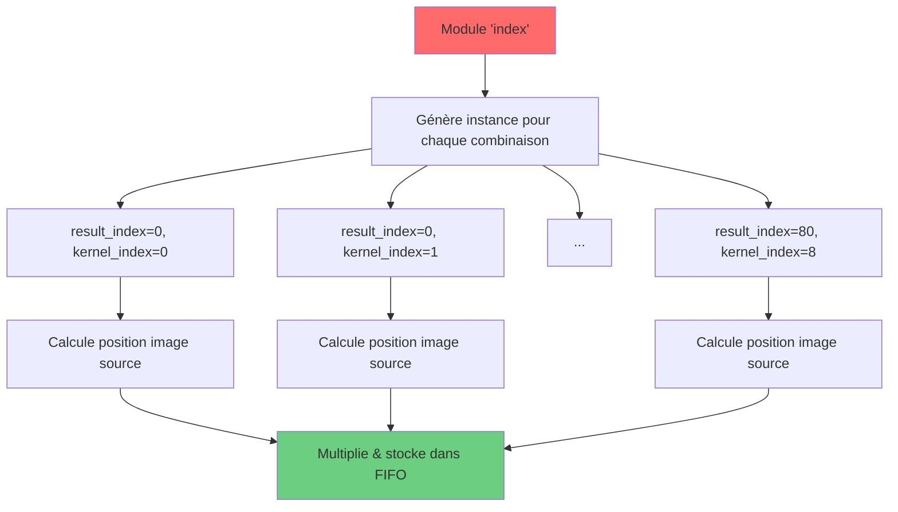

# Accélérateur Hardware de Convolution 2D

Moteur de convolution parallèle avec latence zéro et 729 opérations simultanées.

## 🎯 Que fait ce module ?



Prend une image 9×9 + filtre 3×3 → produit tous les résultats de convolution instantanément

## 🏗️ Comment ça marche

```mermaid
graph TD
    subgraph "🔧 Entrées"
        A[Image: 0,1,2...80]
        B[Kernel: 0,1,2,3,4,5,6,7,8]
    end

    subgraph "⚡ La magie opère"
        C[729 Multiplieurs Parallèles]
        D[Connexions Fil Direct]
        E[Aucune Logique de Contrôle !]
    end

    subgraph "📊 Sortie"
        F[FIFO[0][0] vers FIFO[80][8]]
    end

    A --> C
    B --> C
    C --> D
    D --> E
    E --> F

    style C fill:#ff6b6b
    style D fill:#4ecdc4
    style E fill:#45b7d1
```

## 🧠 Système de Coordonnées Intelligent



## 📸 Exemple Visuel

### Disposition Image d'Entrée


### Kernel 3×3


## ⚡ Performances



## 🛠️ Utilisation

### 1. Lancer la Simulation
```bash
iverilog -o sim tensor.v adder.v && ./sim
```

### 2. Vérifier les Résultats
```
result[0] = 160   # Coin: 4 taps sommés (évite bordures)
result[1] = 300   # Bordure: 6 taps sommés (évite un côté)
result[10] = 540  # Centre: 9 taps sommés (kernel complet)
...
result[80] = 1520 # Coin bas-droite
```

### 3. Exemples Visuels de Convolution


#### Visualisation Types de Convolution

```mermaid
graph TD
    subgraph "🟢 COIN Exemple (Position 0)"
        A1[0 0 0<br/>0 0 1<br/>0 6 7] --> B1[Ignorer: 0,1,2,3,6<br/>Utiliser: 4,5,7,8] --> C1[Résultat = 0×4 + 1×5 + 6×7 + 7×8<br/>= 0 + 5 + 42 + 56 = 103]
    end

    subgraph "🔵 BORDURE Exemple (Position 1)"
        A2[0 0 0<br/>1 2 3<br/>7 8 9] --> B2[Ignorer: 0,1,2<br/>Utiliser: 3,4,5,6,7,8] --> C2[Résultat = 1×3 + 2×4 + 3×5 + 7×6 + 8×7 + 9×8<br/>= 3 + 8 + 15 + 42 + 56 + 72 = 196]
    end

    subgraph "⚫ CENTRE Exemple (Position 10)"
        A3[0 1 2<br/>9 10 11<br/>18 19 20] --> B3[Tout utiliser: 0,1,2,3,4,5,6,7,8] --> C3[Résultat = 0×0 + 1×1 + 2×2 + 9×3 + 10×4 + 11×5<br/>+ 18×6 + 19×7 + 20×8 = 540]
    end

    style A1 fill:#c8e6c9
    style A2 fill:#bbdefb
    style A3 fill:#f5f5f5
    style C1 fill:#c8e6c9
    style C2 fill:#bbdefb
    style C3 fill:#f5f5f5
```


#### Disposition Kernel 3×3


### 4. Personnaliser la Taille
```verilog
parameter IMG_MAX_X = 16;   // Image plus grande
parameter CONV_MAX_X = 5;   // Filtre plus grand
```

## 🔍 Architecture Approfondie

### 🔄 Propagation Doublement Récursive

```mermaid
flowchart TD
    subgraph "🔧 Génération d'Instance"
        A[Instance Courante<br/>result_index, kernel_index]
        A --> B{Dans l'Image?}
        B -->|Oui| C[Calculer: img[pixel] × kernel[tap]]
        B -->|Non| D[Ignorer multiplication]
        C --> E[Stocker dans FIFO[fifo_index]]
        D --> E
    end

    subgraph "📡 Récursive1: Propagation FIFO"
        F{kernel_index < 9?}
        F -->|Oui| G[Générer recursive1<br/>kernel_index + 1]
        G --> H[Propager FIFO vers le haut]
        F -->|Non| I[FIFO complet pour result_index]
    end

    subgraph "⚡ Arbres Additionneurs: Sommation Position-Aware"
        J{kernel_index == 0?}
        J -->|Oui| K[Lancer adder_tree]
        K --> L{Type de Position?}
        L -->|Coin| M[Sommer 4 taps<br/>Ignorer taps bordure]
        L -->|Bordure| N[Sommer 6 taps<br/>Ignorer taps côté]
        L -->|Centre| O[Sommer tous les 9 taps]
        M --> P[Stocker dans result[result_index]]
        N --> P
        O --> P
    end

    subgraph "📡 Récursive2: Propagation Result"
        Q{result_index < 81?}
        Q -->|Oui| R[Générer recursive2<br/>result_index + 1]
        R --> S[Propager result vers le haut]
        Q -->|Non| T[Toutes convolutions terminées]
    end

    E --> F
    I --> J
    P --> Q

    style A fill:#ff6b6b
    style H fill:#4ecdc4
    style S fill:#6bcf7f
    style T fill:#ffd93d
```

### 🎯 Adressage Intelligent & Transformation Coordonnées

```mermaid
flowchart LR
    subgraph "📍 Mapping d'Entrée"
        A[result_index] --> B[result_y = idx ÷ 9<br/>result_x = idx mod 9]
        C[kernel_index] --> D[kernel_y = idx ÷ 3<br/>kernel_x = idx mod 3]
    end

    subgraph "🧮 Calcul Source"
        B --> E[img_y = result_y + kernel_y - 1]
        D --> E
        B --> F[img_x = result_x + kernel_x - 1]
        D --> F
        E --> G[img_index = img_y × 9 + img_x]
        F --> G
    end

    subgraph "✅ Vérification Limites"
        G --> H{img_y ≥ 0 && img_y < 9<br/>&&<br/>img_x ≥ 0 && img_x < 9}
        H -->|Vrai| I[Extraire img[img_index]]
        H -->|Faux| J[Ignorer: Hors image]
    end

    style A fill:#e3f2fd
    style C fill:#fff3e0
    style I fill:#e8f5e8
    style J fill:#ffebee
```

### 📦 Architecture Flux de Données

```mermaid
graph TD
    subgraph "🔢 Données Brutes"
        A[Image 9×9<br/>81 pixels]
        B[Kernel 3×3<br/>9 poids]
    end

    subgraph "⚡ Couche Traitement"
        C[729 Multiplications<br/>Parallèles]
        D[Stockage FIFO<br/>81×9 = 729 valeurs]
    end

    subgraph "🎯 Couche Agrégation"
        E[Détection Position<br/>Coin/Bordure/Centre]
        F[Sommation Sélective<br/>4/6/9 taps]
        G[81 Arbres Additionneurs]
    end

    subgraph "📊 Sortie Finale"
        H[result[0..80]<br/>81 résultats convolution]
    end

    A --> C
    B --> C
    C --> D
    D --> E
    E --> F
    F --> G
    G --> H

    style C fill:#ff6b6b
    style D fill:#4ecdc4
    style G fill:#45b7d1
    style H fill:#6bcf7f
```

## 🎯 Pourquoi c'est génial

| Fonctionnalité | Avantage |
|----------------|----------|
| 🚀 **Latence Zéro** | Résultats disponibles instantanément |
| ⚡ **Parallèle Massif** | 729 opérations à la fois |
| 🔧 **Pas de Logique de Contrôle** | Juste multiplieurs + fils |
| 📦 **Intégration Facile** | Intégrer dans n'importe quel design FPGA |
| 🎯 **Configurable** | Changer les tailles facilement |

## 🌟 Applications



## 🔬 Comment ça marche vraiment

### Le Secret : Récursion Paramétrique


### Transformation Coordonnées Magique
```mermaid
graph LR
    A[result_index=10] --> B[Position sortie: ligne 1, col 1]
    C[kernel_index=4] --> D[Centre du kernel 3×3]
    B --> E[Pixel source: position 10 dans image]
    D --> E
    E --> F[img[10] × kernel[4] = 10 × 4 = 40]
    F --> G[Stocké dans FIFO[10][4]]

    style F fill:#ffd93d
    style G fill:#6bcf7f
```

## Licence

AGPL v3